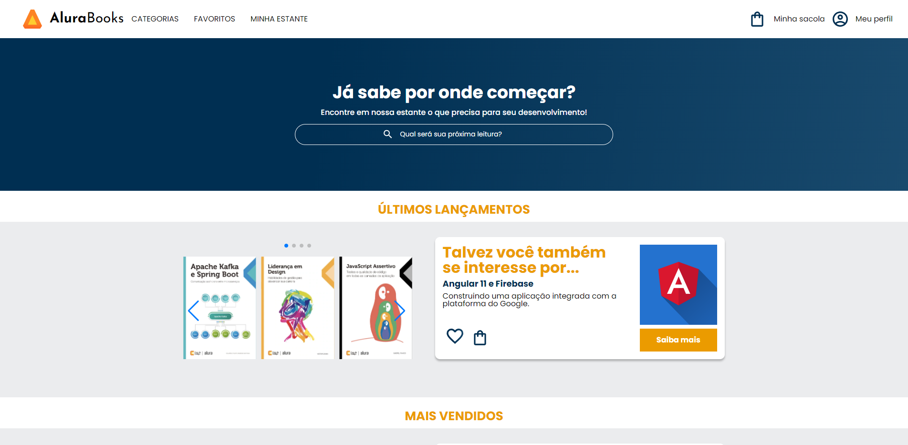

# Alura Books

>Alura | Cursos online de Tecnologia

>Formação em Front-END

Projeto construído no curso HTML e CSS: responsividade com mobile-first.

🔗[Clique aqui para acessar](https://matheus-liber.github.io/alurabooks/)

## 🛠 Tecnologias

- HTML
- CSS
- Git e Github

## 💬 Explicação

- Neste projeto, simulamos a Home Page de um site ficítio de compras de livros chamado Alura Books;

- A página é compartimentalizada em algumas seções, cada uma com suas própria peculiaridades;

- O projeto foi construído com base no conceito *_mobile first_*, sendo produzido primeiramente para resolução de celular e posteriormente adaptada para resolução de tablet e desktop respectivamente, tornando assim o site responsivo.

## 📩 Contato

LinkedIn: https://www.linkedin.com/in/matheus-silva-37b255123/

Email: matheuslibergt@gmail.com

Telefone: (84) 9 9817-8553
